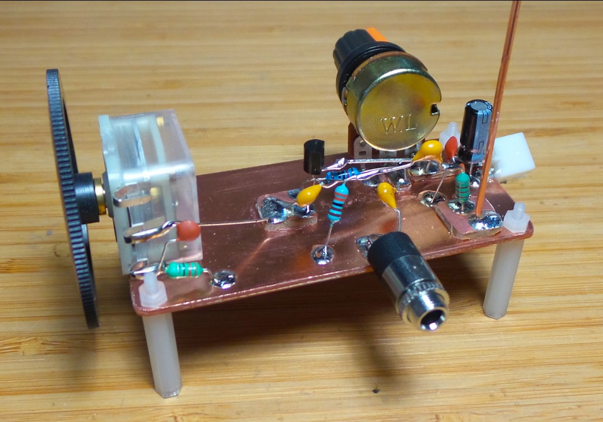
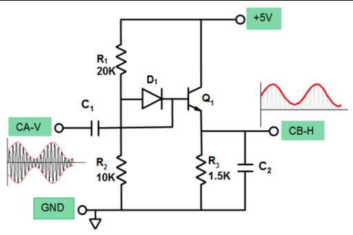
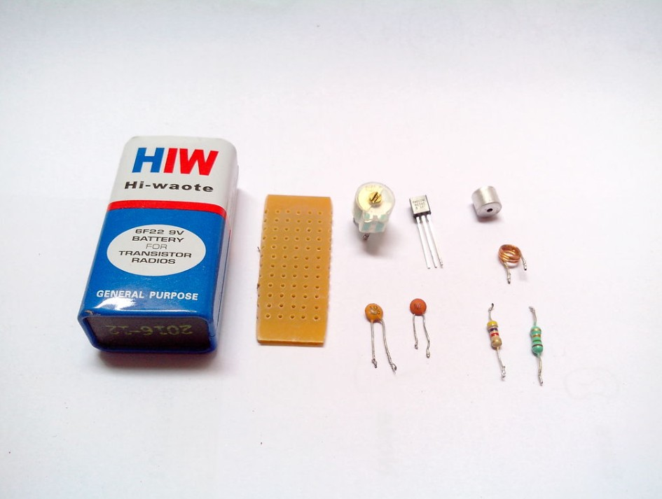
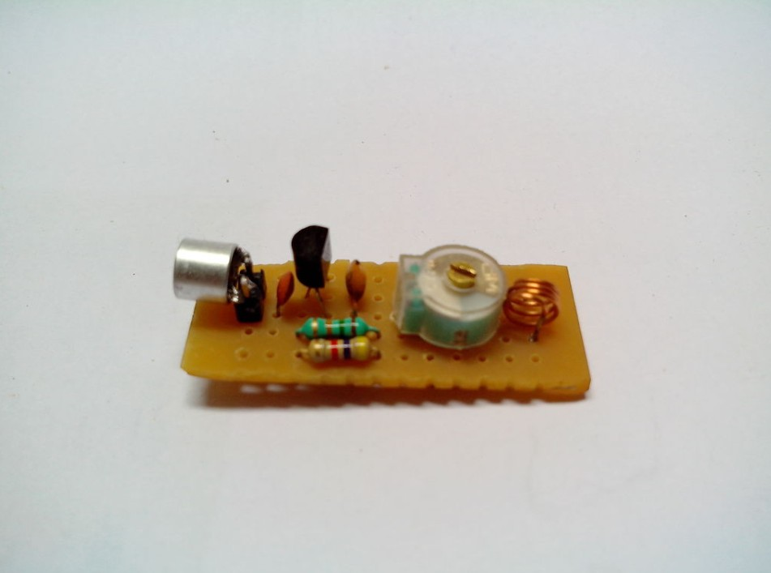
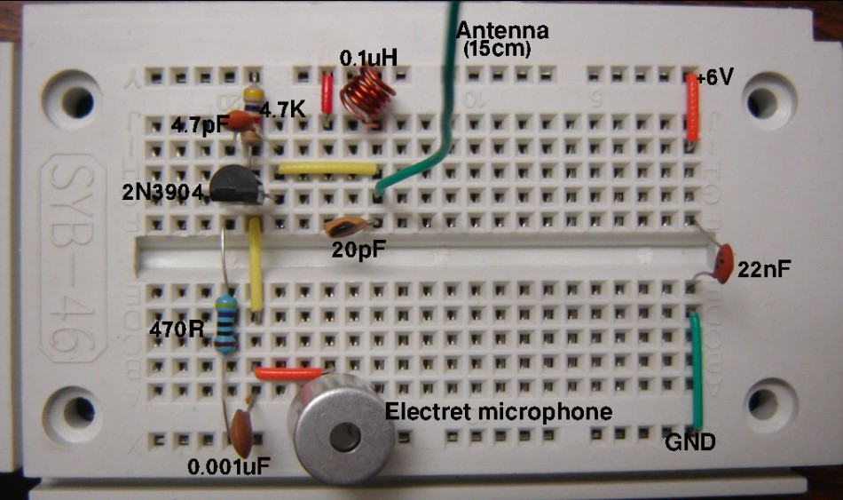
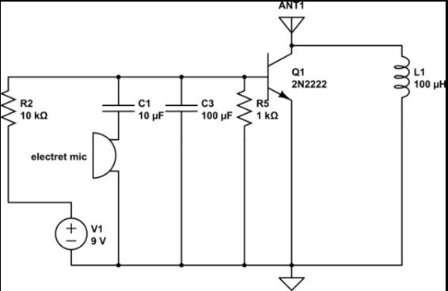

# DISCRETE-AM-COMMUNICATION-SYSTEM-RF-TRANSMISSION-AND-ENVELOPE-DETECTION
Discrete AM communication system using RF transmitter and envelope detector receiver. Generates and modulates a carrier using audio input and recovers it through demodulation. Demonstrates practical RF design, signal propagation, and analog communication fundamentals in hardware.
# 📡 AM Transmitter and Receiver Using Discrete Components
<p align="center">
  
</p>
<p align="center">
  
</p>

##  Description

This project demonstrates the design and implementation of a complete Analog Communication System using discrete components. It includes an AM transmitter that modulates an RF carrier using an audio signal and a receiver that demodulates the transmitted signal using an envelope detector.

The project bridges theoretical concepts of amplitude modulation with practical hardware implementation, highlighting real-world RF behavior, signal propagation, and analog circuit limitations.

---

##  System Overview

The system consists of two main blocks:

* **Transmitter** → Generates and modulates RF signal
* **Receiver** → Detects and recovers the original audio signal

```text
Microphone → RF Oscillator → AM Modulation → Antenna → Air → Receiver → Audio Output
```

---

##  Transmitter Design
<p align="center">
  
</p>
<p align="center">
  
</p>
###  Working Principle

The transmitter is based on a high-frequency LC oscillator (Colpitts configuration) that generates a carrier signal. The microphone input introduces variations in the base bias of the transistor, which results in amplitude modulation of the carrier.

###  Key Components

* BJT (BC547 / 2N2222) → Active device
* Electret Microphone → Audio input
* LC Tank Circuit → Carrier generation
* Capacitors → Feedback and coupling
* Antenna → Signal transmission

###  Operation
<p align="center">
  
</p>
<p align="center">
  
</p>

* LC tank generates RF carrier (MHz range)
* Microphone signal modulates amplitude
* Output signal is transmitted via antenna

---

##  Receiver Design

###  Working Principle

The receiver uses an envelope detector to extract the audio signal from the incoming AM wave. A diode rectifies the RF signal, and a capacitor filters out the high-frequency component, leaving the audio signal.

###  Key Components

* Diode (1N4148 / Germanium preferred)
* Capacitor (filtering)
* Resistor (load)
* Antenna → Signal reception
* Earphone / Amplifier → Audio output

###  Operation

* Antenna receives AM signal
* Diode performs rectification
* RC network extracts envelope
* Audio signal is recovered

---

##  Modulation Concept

Amplitude Modulation is defined as:

```math
s(t) = A_c (1 + m(t)) \cos(2\pi f_c t)
```

Where:

* ( A_c ) = Carrier amplitude
* ( m(t) ) = Modulating signal (audio)
* ( f_c ) = Carrier frequency

---

## 📊 Experimental Results

* Successful transmission and reception of audio signals
* Clear modulation observed in transmitted waveform
* Audio recovered using simple envelope detector
* Demonstrated short-range wireless communication

---

## ⚠️ Practical Challenges

* Noise and interference in RF environment
* Stability issues due to component tolerances
* Limited transmission range
* Parasitic capacitances affecting performance

---

## 🧠 Key Learnings

* Practical implementation of amplitude modulation
* RF signal generation and propagation
* Envelope detection and demodulation
* Differences between ideal theory and real hardware

---


## 🚀 Future Improvements

* Add RF amplifier stage for increased range
* Implement tuned receiver for better selectivity
* Use PCB design for improved stability
* Integrate audio amplification stage

---

## 💡 Key Takeaway

This project demonstrates a complete analog communication system built from scratch using discrete components. It highlights the practical challenges and insights involved in RF design, modulation, and signal recovery, making it a strong foundation for advanced analog and communication engineering.

